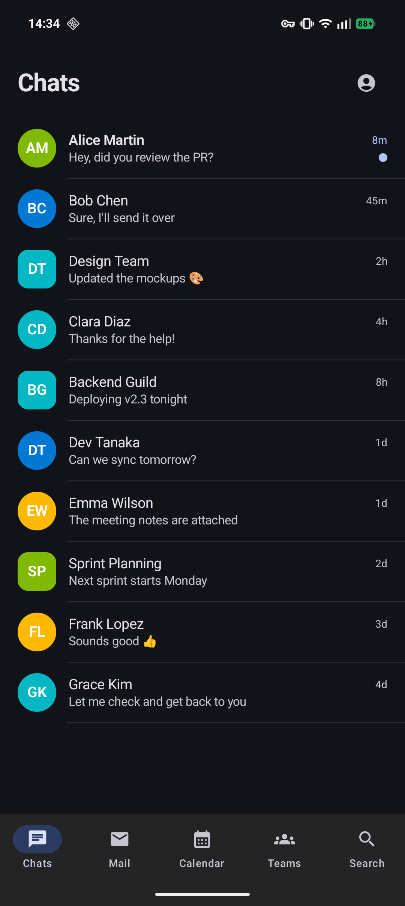
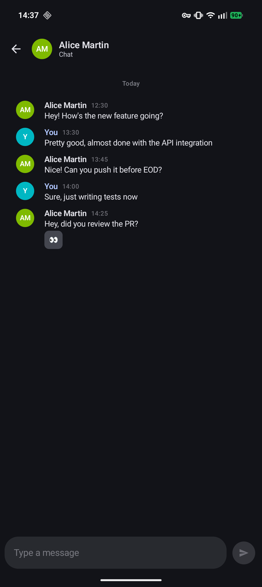
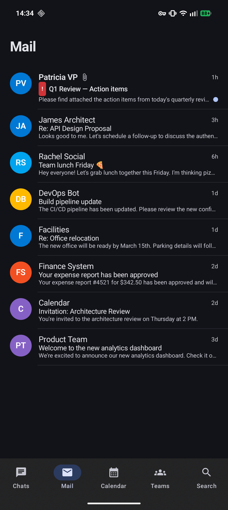
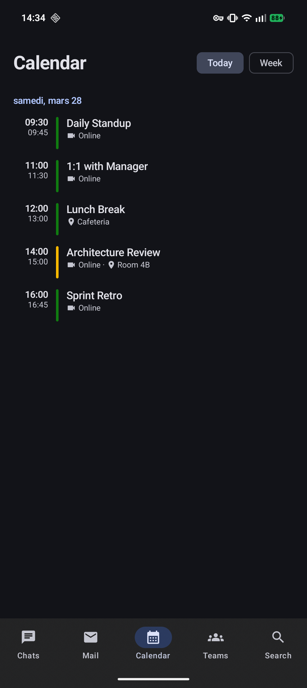

# Squads

A native Android client for Microsoft Teams & Outlook — built with Jetpack Compose and Material 3.

Squads lets you access your chats, emails, calendar, and teams through a clean, fast, alternative interface. It authenticates via Microsoft's device code OAuth flow and talks directly to the Graph API and Teams APIs.

## Screenshots

<p align="center">
  
  
  
  
</p>

## Features

- **Chats** — real-time conversations via Trouter push notifications, inline images, reactions, swipe-to-reply with blockquotes, and profile photos
- **Mail** — inbox with importance badges, attachment indicators, read/unread state, and detail view
- **Calendar** — today/week toggle with color-coded response status, event details, attendees, and online meeting links
- **Teams** — browse teams, channels, and threaded messages with reactions and reply counts
- **Search** — unified search across chats, mail, and calendar events
- **Demo mode** — explore the app with realistic sample data, no account needed

## Requirements

- Android 8.0+ (API 26)
- A Microsoft work/school account (organization accounts only)
- [just](https://github.com/casey/just) command runner (optional, for dev commands)

## Getting started

```bash
# Clone
git clone https://github.com/kernoeb/squads-app.git
cd squads-app

# Build and install on a connected device
just run

# Or use Gradle directly
./gradlew installDebug
```

On first launch, sign in with a Microsoft work/school account via the device code flow, or tap **Continue with demo data** to explore without credentials.

## Development

```bash
just              # list all available commands
just build        # build debug APK
just release      # build release APK
just run          # build + install + launch
just lint         # run lint checks
just ktlint       # check code style
just format       # auto-format code
just test         # run unit tests
just test-device  # run instrumented tests
just maestro      # run Maestro UI tests
just logcat       # filtered logcat output
just restart      # kill + relaunch
just clean        # clean build artifacts
just deps         # show project dependencies
just ship 0.3.0   # tag, push, wait for CI, download APK
```

## Tech stack

| Layer | Tech |
|-------|------|
| UI | Jetpack Compose, Material 3 |
| Navigation | Navigation 3 (type-safe routes, kotlinx.serialization) |
| Architecture | MVVM, StateFlow, coroutines |
| Networking | OkHttp 5 |
| Images | Coil 3 |
| Persistence | Room |
| DI | Hilt |
| Auth | Microsoft OAuth device code flow |
| API | Microsoft Graph, Teams Chat Service, Trouter |
| HTML | Jsoup |
| Effects | Haze (glassmorphism nav bar) |
| Performance | Baseline profiles |
| Splash | AndroidX SplashScreen |
| Linter | ktlint via ktlint-gradle |
| UI Testing | Maestro |
| Unit Testing | JUnit 6 (Jupiter) |
| Font | Inter via Google Fonts |

## Project structure

```
app/src/main/java/com/squads/app/
├── auth/           # OAuth flow & token management
├── data/           # API clients (TeamsApiClient, MailApi, CalendarApi),
│   │                 models, Room DB, HTML parser, JSON extensions
│   ├── db/         # Room database, entities, DAOs, mappers
│   └── repository/ # ChatRepository, MailRepository
├── di/             # Hilt dependency injection
├── ui/
│   ├── auth/       # Login screen
│   ├── calendar/   # Calendar views
│   ├── chats/      # Chat list, detail, components, image viewer
│   ├── components/ # Shared UI (Avatar, ChatAvatar, ScreenHeader, badges)
│   ├── mail/       # Mail list & detail
│   ├── navigation/ # Navigation graph & type-safe routes
│   ├── profile/    # Profile & settings
│   ├── search/     # Search screen
│   ├── teams/      # Teams, channels, messages
│   └── theme/      # Colors, typography
└── viewmodel/      # ViewModels for each feature

.maestro/             # Maestro UI test flows (demo login, navigation, etc.)
app/src/test/         # JUnit 6 unit tests (HtmlParser, JSON, presence, time)
```

## Disclaimer

This project is not affiliated with, endorsed by, or officially connected to Microsoft. Use of Microsoft's APIs may be subject to their terms of service. Use at your own risk.

## License

[MIT](LICENSE)
